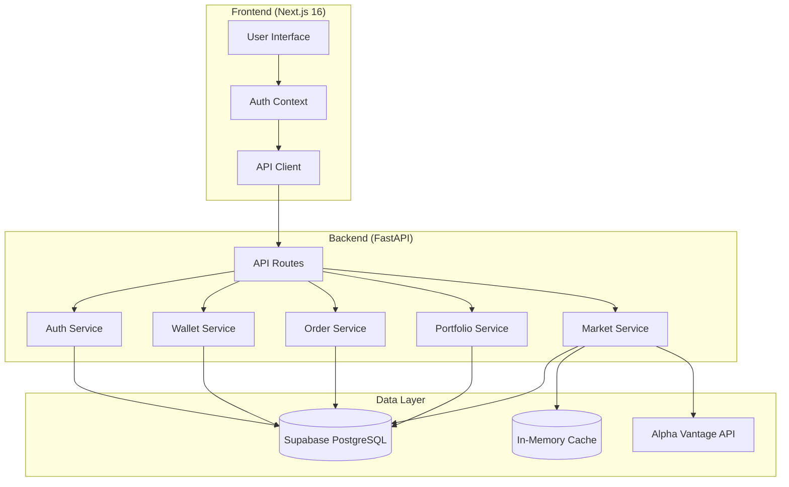

# CEX - Centralized Exchange

A simulated stock trading platform where users can sign up, view stock performance, deposit/withdraw virtual INR, and place buy/sell orders.

## ⚠️ Disclaimer

This is an **educational MVP** - a learning project. It does NOT involve:
- Real money transactions
- Real KYC verification
- Real brokerage connections
- Regulatory compliance

All trading is simulated with virtual INR (₹10,000 default balance).

---

## Architecture



---

## How It Works

### 1. User Registration & Authentication

- Users sign up with email/password
- Supabase Auth handles user management
- JWT tokens are issued for session management
- Each new user gets ₹10,000 virtual INR in their wallet

### 2. Wallet System

- **Deposit**: Add fake INR to wallet (for testing)
- **Withdraw**: Deduct INR from wallet
- All transactions are recorded in the `transactions` table

### 3. Market Data

- Stock prices fetched from Alpha Vantage API
- Mock data fallback when API is unavailable (demo mode)
- 5-minute cache to reduce API calls
- Supports 10 US stocks: AAPL, GOOGL, MSFT, TSLA, AMZN, NVDA, META, NFLX, AMD, INTC

### 4. Trading

- **Market Orders**: Execute immediately at current price
- **Limit Orders**: Set a target price (stored for later execution)
- **Buy**: Deduct INR from wallet, add to holdings
- **Sell**: Add INR to wallet, reduce holdings
- FIFO cost basis for profit/loss calculation

### 5. Portfolio

- View all holdings with current market values
- Calculate profit/loss: `(current_price - avg_buy_price) * quantity`
- Total portfolio value = wallet balance + holdings value

---

## Quick Start

### Prerequisites

- Node.js 18+
- Python 3.10+
- Supabase account (free tier)

### 1. Backend

```bash
cd backend

# Create virtual environment
python3 -m venv venv
source venv/bin/activate

# Install dependencies
pip3 install -r requirements.txt

# Configure environment
cp .env.example .env
# Edit .env with your Supabase credentials

# Run backend
uvicorn app.main:app --reload --port 8000
```

### 2. Frontend

```bash
cd frontend
npm install
npm run dev
```


---

## Tech Stack

| Layer | Technology |
|-------|------------|
| Frontend | Next.js 16, TypeScript, Tailwind CSS |
| Backend | FastAPI, Python |
| Database | Supabase (PostgreSQL) |
| Auth | Supabase Auth, JWT |
| Market Data | Alpha Vantage API |

---

## Project Structure

```
cex/
├── README.md                 # This file
├── AGENTS.md                 # Agent instructions
│
├── backend/                  # FastAPI backend
│   ├── README.md            # Backend-specific docs
│   ├── requirements.txt      # Python dependencies
│   ├── .env.example         # Environment template
│   └── app/
│       ├── main.py          # App entry point
│       ├── db/              # Database config
│       ├── models/          # Pydantic schemas
│       └── routers/         # API endpoints
│
└── frontend/                 # Next.js frontend
    ├── README.md            # Frontend-specific docs
    ├── .env.local           # Environment config
    └── src/
        ├── app/             # Pages (App Router)
        ├── components/      # Reusable components
        └── lib/             # Utilities & API client
```

---

## API Endpoints

### Authentication
- `POST /api/auth/register` - Create account
- `POST /api/auth/login` - Login
- `GET /api/auth/me` - Current user

### Wallet
- `GET /api/wallet` - Get balance
- `POST /api/wallet/deposit` - Add funds
- `POST /api/wallet/withdraw` - Withdraw funds
- `GET /api/wallet/transactions` - Transaction history

### Market
- `GET /api/market/stocks` - All stocks with prices
- `GET /api/market/stocks/{symbol}` - Single stock
- `GET /api/market/search` - Search stocks

### Orders
- `POST /api/orders` - Place order
- `GET /api/orders` - Order history
- `DELETE /api/orders/{id}` - Cancel order

### Portfolio
- `GET /api/portfolio` - Holdings with P/L
- `GET /api/portfolio/summary` - Quick summary

---

## License

MIT License - Educational purposes only.